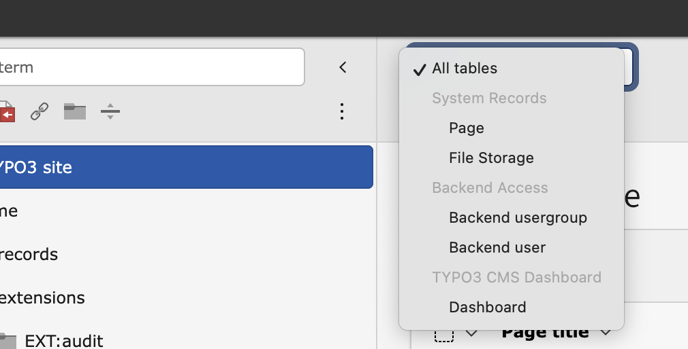
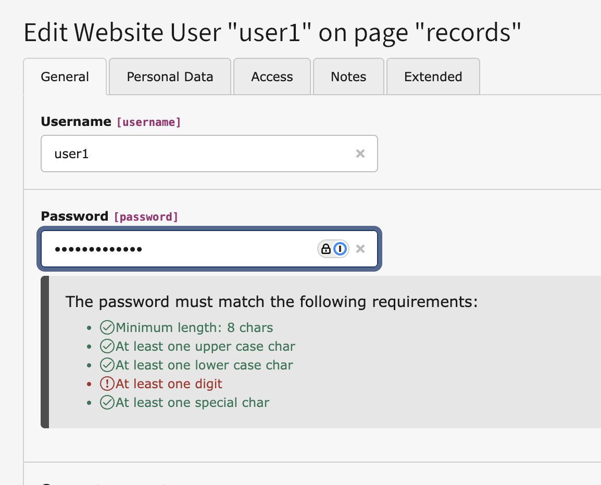

# TYPO3 Extension `invero`

This extension is a collection of various improvements to the TYPO3 Backend:

- Bulk editing
- Record selector in toolbar
- Translated page tree
- Password meter for the backend

*Using mostly XCLASS to achieve those features.*

## Usage

Supported TYPO3 Versions: 14-dev, 13.4 LTS, 12.4 LTS

1. Install the extension, e.g. using `composer req georgringer/invero`.
2. Optionally: Disable the features in the Extension settings you don't want to use.
3. **Done,** give feedback via slack/mail/personal talk

### Why open source?
This extension is open source and free to use. If it improves your workflow or your editors enjoy using it, please consider supporting my work.

A suggested sponsorship amount is €250, but any contribution is appreciated.

Invoices can be provided — just reach out via email: mail@ringer.it.
Your support helps keep this project alive and maintained for future TYPO3 versions.

## Feature description

### Bulk editing

Easily update multiple records at once. For example, hide several items or assign categories in just a few clicks.

 
Watch video demo

https://github.com/user-attachments/assets/acf5e532-dfa8-4254-98c2-89bf1fc41d41

### Record selector in the toolbar

Quickly jump to any record table directly from the backend toolbar — no more endless scrolling.

Click to show screenshot

Click to show video

https://github.com/user-attachments/assets/356496c1-4596-4573-a53f-037f4bbe0be4

### Translated page tree

Browse the page tree in any available backend language.
Great for editors working in translated environments.

Click to show video

https://github.com/user-attachments/assets/bbf84c43-4c6d-42cd-8ee8-5c2591e81428

### Password meter for the backend

Clearly see which password rules are met before submitting — avoiding failed saves and frustration.

Click to show screenshot

Click to show video

https://github.com/user-attachments/assets/e1fe4bb3-a4e4-425d-b1df-9a9e810021e7

**Be aware***: Every password input is sent to the server and can possibly be logged or similar.
